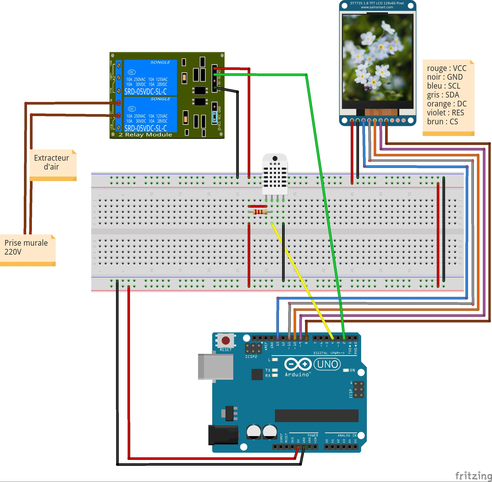

<!--# Ventilateur -->
<!--+ 2020-->
<!--$ Arduino-->
<!--$ Electronique -->
<!--% Un projet de ventilateur permettant de contrôler un extracteur d'air avec une carte Arduino. -->

# Ventilateur

Un projet de ventilateur permettant de contrôler un extracteur d'air avec une carte Arduino.

